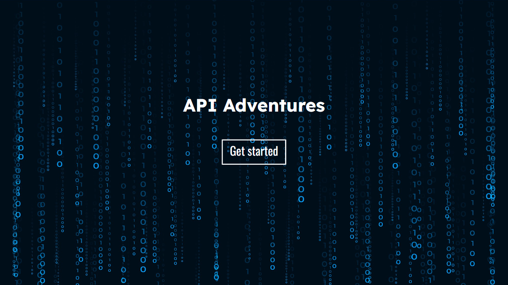
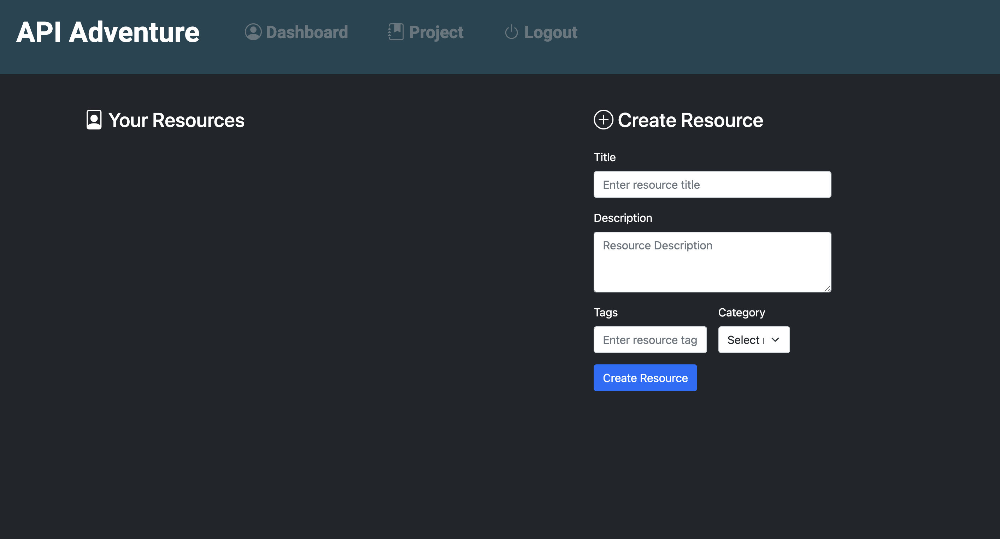
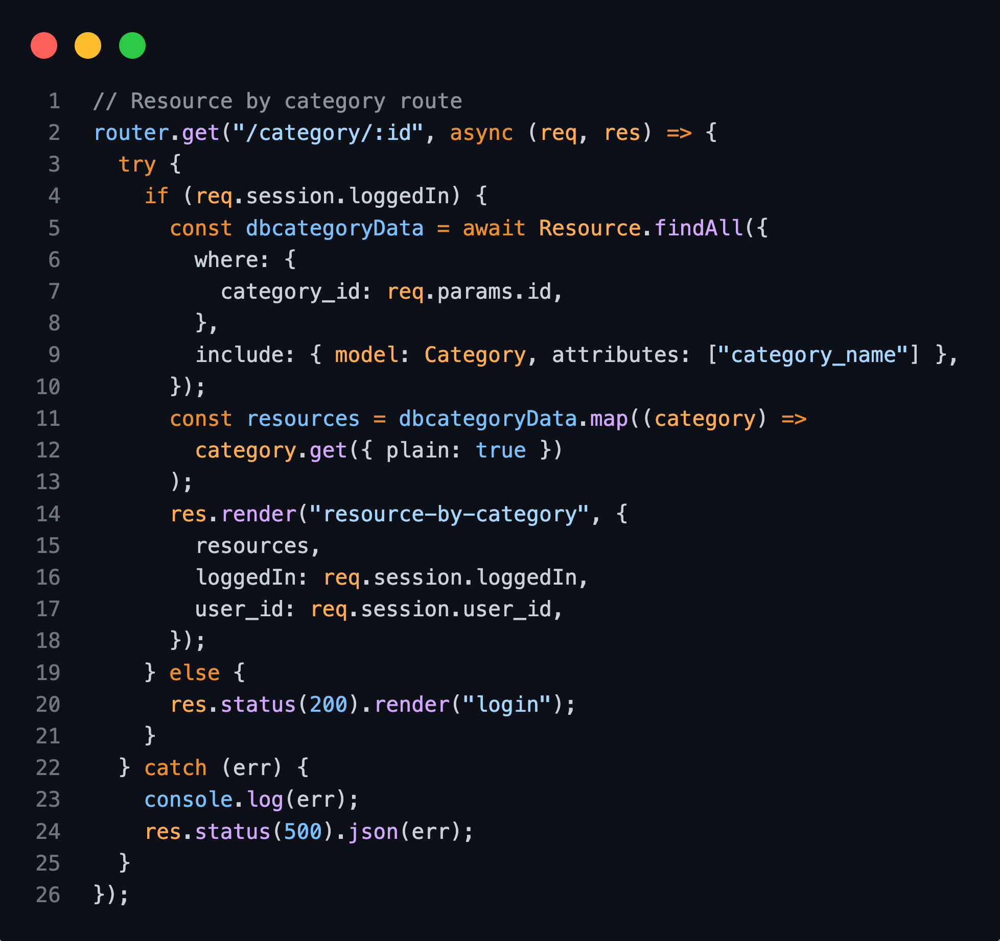
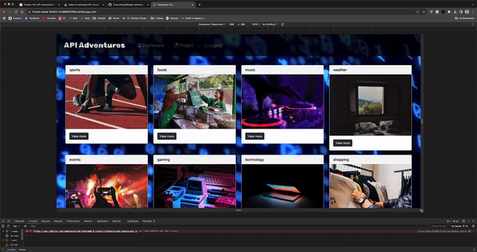
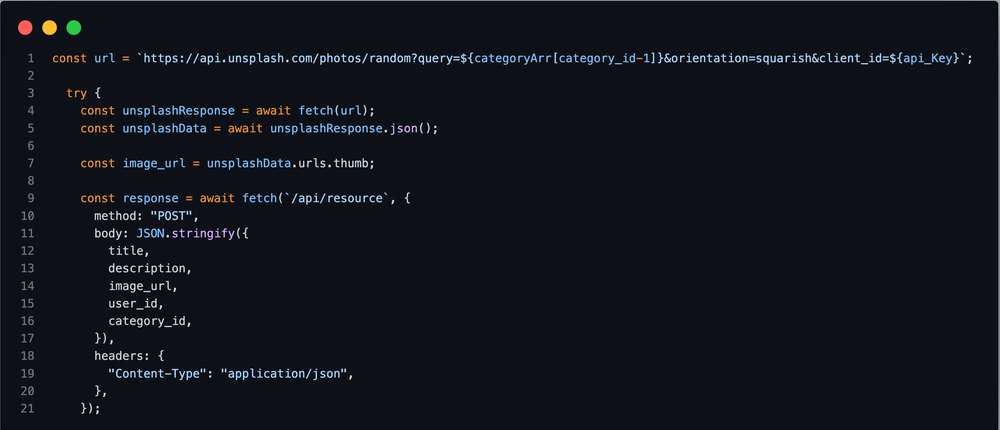

# API-Adventures 

#### Resources:

[Link to live site](https://api-adventure-project-8151c086edbf.herokuapp.com/)

---

#### Technology Used:

[more detail](https://github.com/)

[more detail](https://www.heroku.com/platform)

[more detail](https://developer.mozilla.org/en-US/docs/Web/HTML)

[more detail](https://developer.mozilla.org/en-US/docs/Web/CSS)

[more detail](https://developer.mozilla.org/en-US/docs/Web/JavaScript)

[more detail](https://getbootstrap.com)

[more detail](https://www.npmjs.com/)

 * [mysql2](https://www.npmjs.com/package/mysql2resource)
 * [sequelize](https://sequelize.org/)
 * [express](https://expressjs.com/)
 * [express-handlebar](https://www.npmjs.com/package/express-handlebars)
 * [express-session](https://www.npmjs.com/package/express-session)
 * [dotenv](https://www.npmjs.com/package/dotenv)
 * [handlebars](https://handlebarsjs.com/)
 * [bcrypt](https://www.npmjs.com/package/bcrypt)
 * [MVC](https://developer.mozilla.org/en-US/docs/Glossary/MVC)
 * [Unsplash API](https://unsplash.com/developers)

-----

 #### Description:
API Adventures is an API index by category, for developers, with the ability to save API resources to a user dashboard, create new API resources and add to the index. It is a full-stack web application built using Node.js, Express.js, and MySQL, following the MVC paradigm to ensure a structured and maintainable codebase. It offers a secure and interactive platform with RESTful API endpoints for data retrieval and addition. The application employs Handlebars.js as the templating engine for dynamic content rendering.

#### User Stories:
1. As a User, I want to Get Started, so that I can login or sign up.

2. As a User, I want to log in with a secured account using my email
3. As a User, I want to see API resource posts by category , so that I can use api for my webpage
4. As a User, I want to create a resource post, so that I can share about the insight of this new api.
5. As a User, I want to create a project post, so that I can share a project utilizing a new api.

6.  As a User, I want to view all my resource post on my dashboard, so that I remember what I posted.
7. As a User, I want to click on a resource on homepage, so that I can see details of the post.
8. As a User, I want to update /delete/archive my resource post, so that I can modify my resource post.

----

#### Table of Contents:
  
 * [Installation](#installation)
 * [Usage](#usage)
 * [Highlighted Features](#highlighted-features)
 * [Learning Points](#learning-points)
 * [License](#license)
 * [Badges](#badges)
 * [Tests](#tests)
 * [Contributing](#contributing)
 * [Authors](#authors)

---

#### Installation:
  
* To install all dependencies, run: npm install
* Create the database in MYSQL using the schema.sql.
* To load the seeds into the database, run: npm run seed 
* To start the server, run: node server.js

----

### Usage

**Home Page**

The homepage provides users with a streamlined experience to enter the API index within the site.

---

**Login/Sign Up**

Existing users have the ability to log in and new users have the ability to sign up. 

---

**Resource Index**

The resource index provides users with an at-a-glance view of all of the resource categories. Each API resource is assigned a category to correspond with it's use-case. 

---

**My Dashboard**

Each user has a dashboard, which can be accessed after logging in.

---

**Create Resource**

Resources can be added to a user's dashboard by creating a resource.

---

**Create Project**

Projects can be created and added to a user's dashboard by creating a project.

---

### Highlighted Features:

**RESTful API:** Utilizing Node.js and Express.js, the application provides both GET and POST routes to facilitate seamless interaction with the database.

**Database Integration:** MySQL is employed as the relational database, and Sequelize ORM streamlines data management, ensuring efficient and organized storage.

**Deployment on Heroku:** API Adventures is hosted on Heroku, ensuring accessibility and scalability. The deployment includes the necessary data, ensuring a fully functional application.

**Polished UI:** The user interface is thoughtfully designed, adhering to best practices in user experience. It ensures an intuitive and visually appealing interaction for users.

**Responsiveness:** The application is responsive, adapting seamlessly to various screen sizes and devices, providing an optimal user experience.

**Interactivity:** API Adventures engages users by accepting and responding to their inputs. It fosters dynamic interactions to enhance user engagement.

**MVC Folder Structure:** Following the MVC paradigm, the project maintains a well-organized folder structure. Models, views, and controllers are distinct and logically organized, promoting code maintainability.

**Authentication with Express-Session and Cookies:** User authentication is a priority, implemented using Express-session and cookies. This ensures secure access to user-specific data and actions.

**Environment Variable Security:** API keys and sensitive information are protected using environment variables, adding an extra layer of security to the application.

**Clean Repository:** The project repository adheres to quality coding standards. It demonstrates consistency in file structure, naming conventions, and follows best practices for class and ID naming, indentation, and includes high-quality comments for code documentation.

 **Random Photo Search Technology:** This application utilizes the Unsplash API to get a random photo and sets it as a Project or Resource category profile image.  The Unsplash API allows us to filter the searches and retrieve a random photo for the user and a search a topic related photo for the resource category.

---

## Learning Points:
1. Handlebars.js: Gain proficiency in using Handlebars.js as a templating engine for dynamic content rendering. Understand its syntax and how it integrates with Node.js and Express.js.

2. MVC Paradigm: Implement the MVC (Model-View-Controller) paradigm to organize code efficiently, separating concerns and promoting maintainability.

3. Authentication: Implement user authentication using express-session and cookies to secure access to user-specific data and actions.

4. Deployment on Heroku: Understand the process of deploying a Node.js application on Heroku, including configuring environment variables and ensuring the deployment includes necessary data for a fully functional application.

5. Environment Variable Security: Learn to protect sensitive information, such as API keys, by using environment variables, adding an extra layer of security to the application.

6. Testing with Insomnia: Use tools like Insomnia for testing frontend and backend routes, ensuring proper functionality and identifying potential issues.

----

#### License:

 This project is licensed with MIT license

 Link to License - [Website to MIT License]((https://opensource.org/license/mit))

-----

 ## Tests:
 
 This application tested the the front end and backend routes using Insomnia Core application

  
 
 ## Authors:

 Anna Rose Benedetti

 - [Portfolio](https://abenedetti27.github.io/Portfolio/)
 - [LinkedIn](https://www.linkedin.com/in/anna-rose-benedetti/)
 - [GitHub](https://github.com/abenedetti27)

 Armando Arujo

 - [Portfolio](https://armand57araujo.github.io/Portfolio/)
 - [LinkedIn](https://www.linkedin.com/in/armand-araujo-a82ba2291/)
 - [GitHub](https://armand57araujo.github.io/Portfolio/)

 Thai Nghiem

 - [Portfolio](https://main--j-studio-rjs.netlify.app/)
 - [LinkedIn](https://www.linkedin.com/in/thai-nghiem-319292267/)
 - [GitHub](https://github.com/Truecoding4life)

 Andy Zurek

 - [Portfolio](https://azurek17.github.io/zurek-portfolio/)
 - [LinkedIn](https://www.linkedin.com/in/andy-zurek-374bb9291/)
 - [GitHub](https://github.com/AZurek17)
